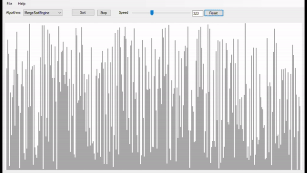
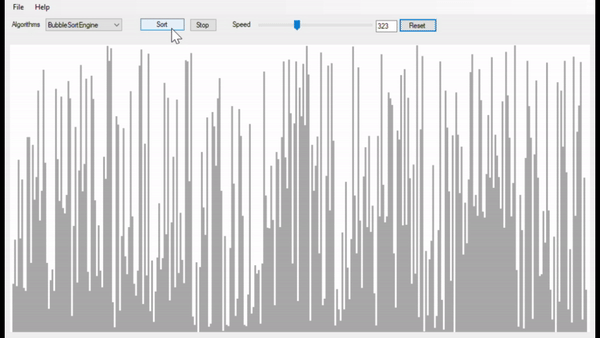

*************************************************************************************************
# Algorithm Visualizer
*************************************************************************************************

A tool for visualizing various algorithms in real-time, by breaking them down into visual steps, making it easier to follow the process behind them. 
- Multiple Algorithms Supported.
- Interactive Controls: Start, pause, reset, and control the speed of visualization.

 

---
 

    
    

